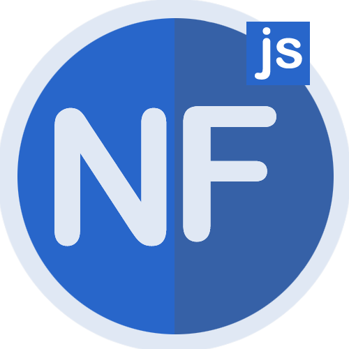

<p align='center'>
    <a href='https://nefbl.github.io/api' target='_blank'>
        
    </a>
</p>

# Nefbl | 新一代前端框架（文档）

## 如何启动本地编辑？

首先，你需要确保本地安装了node.js，然后，执行下面命令安装项目依赖：

```bash
npm install
```

接着，启动下面命令后打开页面（ http://127.0.0.1:20000/ ）即可，修改内容页面也自动刷新：

```bash
npm run dev
```

如果你想发布开发的代码，执行下面命令进行打包：

```bash
npm run build
```

开源协议
---------------------------------------
[MIT](https://github.com/nefbl/api/blob/master/LICENSE)

Copyright (c) 2021 [hai2007](https://hai2007.gitee.io/sweethome/) 走一步，再走一步。
